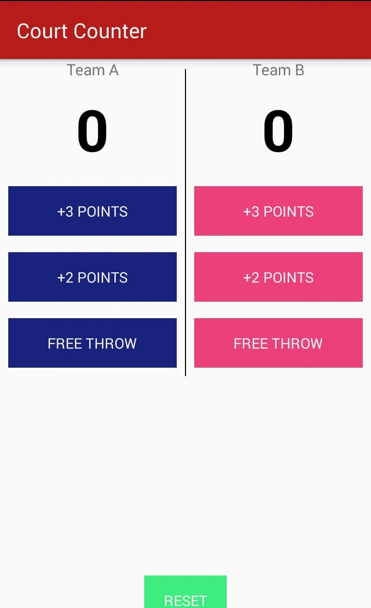
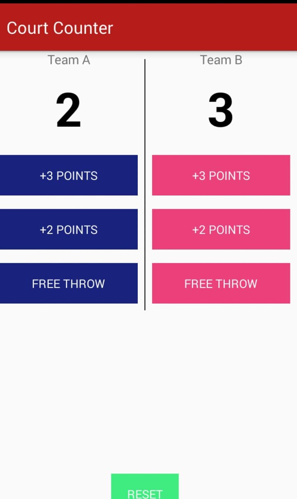
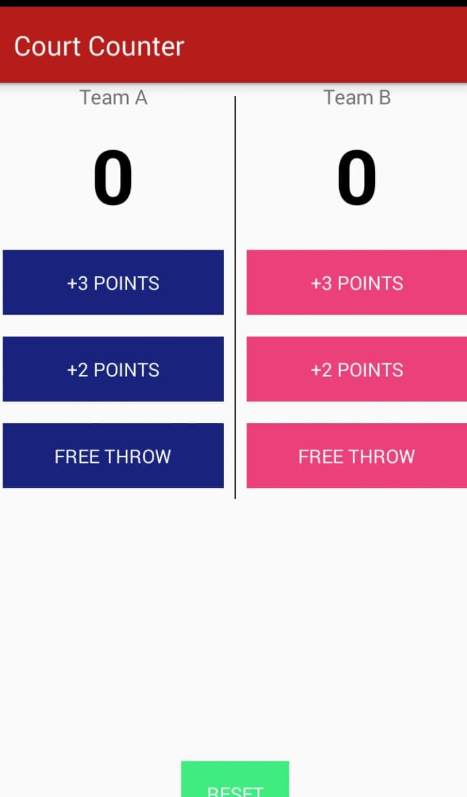

# Court-Counter

simple app to calculate score for basket game between 2 players.

# HOW TO RUN

## when you open the app.

## then you click on 3 points for a team and 2 points for the other team.

## when you click on reset button .

# Implementation

the code divided to:

1-front end:

xml File contains some buttons.

2-back end:

function to calculate score for each team.
